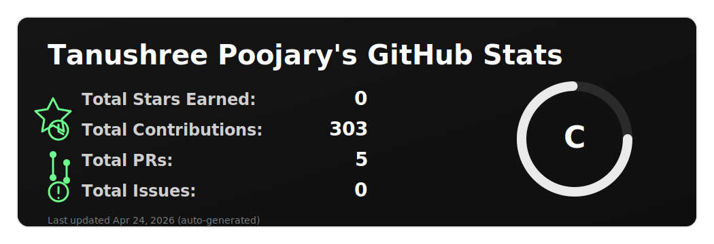

<p align="center">
  
</p>


<p>

  <a href="mailto:tanushreepoojary2000@gmail.com">
    
  </a>

  <a href="https://www.linkedin.com/in/poojarytanushree/">
    
  </a>

  <a href="https://leetcode.com/u/tanushreepoojary2000/">
    
  </a>

</p>

## Hey there 👋

I’m Tanushree Poojary, an aspiring Product Data Analyst, creative coder and self-proclaimed designer who specializes in front-end development.  
I make it my mission to translate user-focused designs into pixel-perfect websites or applications that run blazing fast.

Want to know more about me?  
👉 **[Check out my portfolio.](https://yourportfolio.com)**

---
## Who am I?

```python
class TanushreePoojary:

    def __init__(self):
        self.role = "Aspiring AI & Product Data Analyst"
        self.mission = "Transform complex data into strategic product decisions"
        self.superpower = "Finding patterns where others see noise 📊"

        self.tech_stack = {
            "Languages": ["Python", "SQL"],
            "BI Tools": ["Power BI", "Tableau", "Excel"],
            "ML": ["scikit-learn", "Regression", "Clustering"],
            "Analytics": ["A/B Testing", "Cohort Analysis", "Funnel Metrics"]
        }

    def current_focus(self):
        return [
            "Product Metrics & KPI Design",
            "User Behavior Analysis",
            "Predictive Modeling",
            "Experimentation & Growth Analytics"
        ]

    def ambitions(self):
        BuildDataDrivenProducts()
        DriveBusinessImpact()
        OptimizeUserExperience()
        KeepLearningRelentlessly()

    def mindset(self):
        return "Curious. Analytical. Impact-focused."
```

## 📝 Latest Blog Posts : 👉 **[Check out](https://thegirlwholovesdata.hashnode.dev/)**


---

# ⚙️ Some Tool and Tech I use

- 🚀 **I use daily:**  
  
  
  
  
  

- 💻 **I work using:**  
  
  
  
  
  

- ⚙️ **I also work and use:**  
  
  
  
  
  
  
  

- 🌱 **Learning all about:**  
  
  
  
  
  

<!-- ================= My DevSetup ================= -->
<h2>🖥️ My DevSetup</h2>

<p>
  
  
  
  
  
  
  
</p>


---


## 📊 GitHub Stats

<p >
  
</p>


