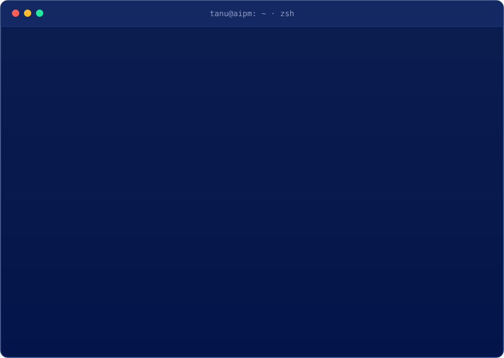
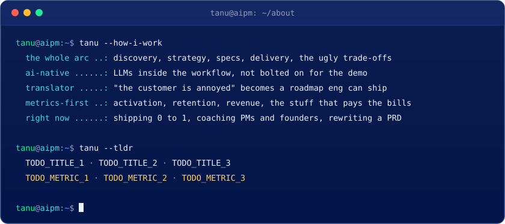
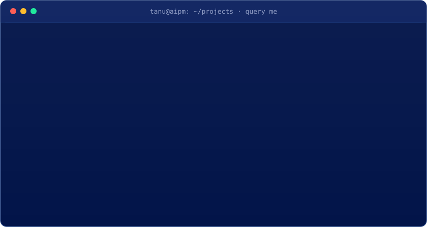
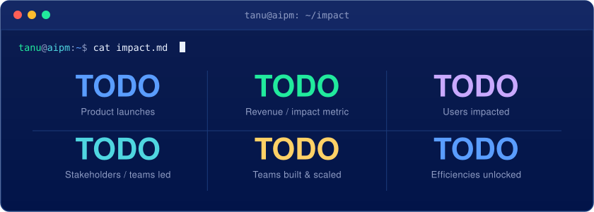
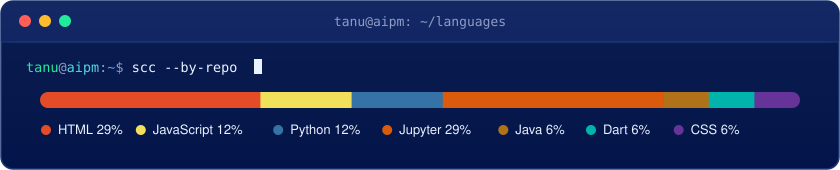
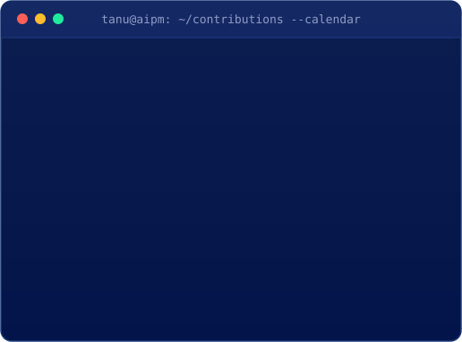
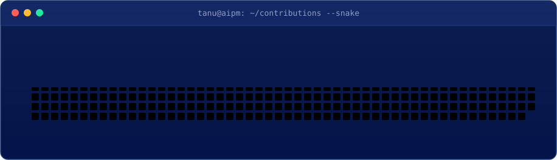

<!--
  Tanushree Poojary · GitHub profile README
  terminal.svg + impact.svg are auto-generated (scripts/ + .github/workflows/refresh.yml)
  Interactive terminal lives in /docs and is served on GitHub Pages.
-->

<!-- ░░ AUTO-PLAYING TERMINAL (click to run the live one) ░░ -->

this terminal is real. <a href="https://tanushree2000.github.io/tanushree2000/" target="_blank" rel="noopener noreferrer"><b>click it to type your own commands</b></a> · auto generated daily by <code>scripts/gen_terminal.js</code>

# Tanushree Poojary
### `AI-Powered PM`

<!-- TODO: replace this tagline with your own -->
TODO: your one-line tagline — what kind of PM you are and what you're proving.

<!-- ░░ PRIMARY CTA ░░ -->

<!-- ░░ SIGNAL BADGES ░░ -->

<!-- TODO: update these badge numbers with your own -->

---

## 👋 About

---

## 🧰 Toolbox

**🎯 Product & Delivery**

**📊 Analytics & Insight**

**⚙️ Technical & AI**

**🧠 Ways of Working**

---

## 🗂️ Projects

<!-- ░░ HIGHLIGHT: what I'm building now ░░ -->
<table width="100%">
<tr><td align="center">

## 🤖 AI-Era Live Products &nbsp; <code>2023 → Now</code>

**The next chapter, built AI-native.** Products with the model living inside the workflow, not bolted on for the demo. Heads-down in the field, shipping. 🛠️

&nbsp;

</td></tr>
</table>

 

The track record that got me here 👇

<!-- TODO: this whole table is placeholder — swap in your real project
     categories, repo links, and one-line descriptions. Delete any column
     that doesn't apply to you. -->
<table>
<tr>
<td valign="top" width="25%">

### 🚀 Category 1
`TODO_YEARS`

TODO one-line description of this category.

<a href="https://github.com/tanushree2000/TODO_REPO" target="_blank" rel="noopener noreferrer">TODO_PROJECT_NAME</a> · TODO short description
 <a href="https://github.com/tanushree2000/TODO_REPO" target="_blank" rel="noopener noreferrer">TODO_PROJECT_NAME</a> · TODO short description

</td>
<td valign="top" width="25%">

### 🧠 Category 2
`TODO_YEARS`

TODO one-line description of this category.

<a href="https://github.com/tanushree2000/TODO_REPO" target="_blank" rel="noopener noreferrer">TODO_PROJECT_NAME</a>
 <a href="https://github.com/tanushree2000/TODO_REPO" target="_blank" rel="noopener noreferrer">TODO_PROJECT_NAME</a>

</td>
<td valign="top" width="25%">

### ⚙️ Category 3
`TODO_YEARS`

TODO one-line description of this category.

<a href="https://github.com/tanushree2000/TODO_REPO" target="_blank" rel="noopener noreferrer">TODO_PROJECT_NAME</a>

</td>
<td valign="top" width="25%">

### 🧩 Category 4
`TODO_YEARS`

TODO one-line description of this category.

<a href="https://github.com/tanushree2000/TODO_REPO" target="_blank" rel="noopener noreferrer">TODO_PROJECT_NAME</a>

</td>
</tr>
</table>

 

want the detail on any of these? query them 👇

<a href="https://tanushree2000.github.io/tanushree2000/" target="_blank" rel="noopener noreferrer" title="Query my projects in the live terminal">
   to learn about each one" width="840">
</a>

<a href="https://tanushree2000.github.io/tanushree2000/" target="_blank" rel="noopener noreferrer"><b>▶ open the live terminal</b></a> and type <code>info project-1</code>, <code>info project-2</code>, or <code>projects</code>

---

## 📊 Stats & Signals

 

 

<!-- Contributions: isometric calendar (left) + snake (right), both auto-generated -->
<table>
<tr>
<td valign="top" width="50%"></td>
<td valign="top" width="50%"></td>
</tr>
</table>

Most of my product work lives off GitHub, so these stay calm. Both refresh daily.

---

## 🤝 Connect with me

<b>Bring me your hardest product problem.</b> 30 minutes, no pitch. Worst case, you walk away with free advice. Pick whatever channel is easiest, I actually reply.

👆 the whole story, services, and results live on <a href="https://www.TODO-your-website.com/" target="_blank" rel="noopener noreferrer"><b>TODO-your-website.com</b></a>

<!-- TODO: replace with your real booking link (Calendly/OneCal/etc.), or delete this line if you don't want one -->

